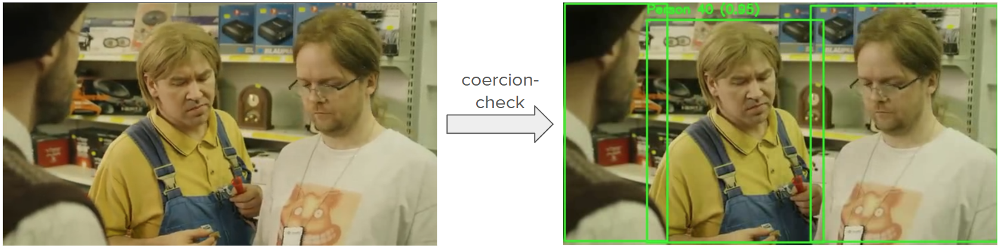

# Video Verification Prediction Software

**This tool is designed to perform a coercion check on videos through a object detection model**. This is for establishing that persons verifying themselves are doing so out of their own volition (as opposed to being coerced or incentivised into doing so). A common indicator of this kind of fraud pattern is the presence of multiple persons during the verification process and this is the basic premise on which I built this tool.

**For a detailed look into the process of proof-of-concepting and a report**, check `src/coercion_check_poc.ipynb` and `report.md` respectively.

## Example

The following video [(Tujurikkuja, 2015)](https://www.youtube.com/watch?v=wtPFdOhNTSc) contains multiple persons. If a person wants to verify their identity and sends a video where there are multiple persons present, this tool will detect these persons, draw bounding boxes around them (this is visible in the tool output) and then classify the video as being coerced.



This tool would classify the video as the having been coerced.

## Project Structure
```
coercion-check/
├── src/
│   ├── __init__.py
│   ├── predict.py
│   ├── utils.py
│   └── models/
│       └── __init__.py
├── requirements.txt
├── README.md
├── report.md
└── setup.py
```

## Installation Instructions

To set up the project, follow these steps:

1. **Clone the repository**:
   ```
   git clone <repository-url>
   cd coercion-check
   ```

2. **Create a Conda environment**:
   ```
   conda create -n coercion-check python=3.9
   conda activate coercion-check
   ```

3. **Install the required dependencies**:
   ```
   conda install -c conda-forge opencv numpy
   pip install -r requirements.txt
   ```
   
   Note: We use Conda to install complex dependencies with binary components like OpenCV,
   while using pip for the remaining Python-specific packages.

4. **Prepare your videos**:
Place all video files for analysis in the `videos/` directory. **NB!** The default config currently accepts only .mp4 files.

## Usage

### Command Line

To run the coercion detection on your videos:

```bash
python coercion_check.py
```

To specify a config:
```bash
python coercion_check.py --config "configs/default_config.yaml"
```
### Configuration
You can customize the detection parameters in the `default_config.yaml` file or create new configs.

```
YOLO_MODEL_PATH: "models/yolov8m.pt"  # Path to YOLO model
CONFIDENCE_THRESHOLD: 0.6             # Detection confidence threshold
VIDEO_PATHS: "videos/*.mp4"           # Video file pattern
OUTPUT_DIR: "output"                  # Output directory
LOG_LEVEL: "INFO"                     # Logging level
VISUALIZATION: true                   # Save annotated videos
```


### Results

The commands above will place results with tracked videos into `output/`. Each run produces:

- Detection results in CSV format
- Summary report
- Annotated videos showing detected people

## Contributing

Contributions are welcome! Please feel free to fork, submit pull requests etc.