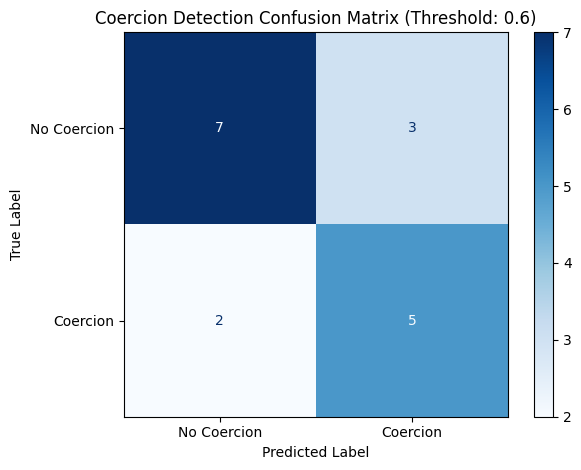

# Coercion Check Report

## Project Overview
`coercion-check` is for establishing that persons verifying themselves are doing so out of their own volition (as opposed to being coerced or incentivised into doing so). A common indicator of this kind of fraud pattern is the presence of multiple persons during the verification process and this is the basic premise on which I built this tool.

The PoC was tested in `src/coercion_check_poc.ipynb` and then a tool was built around it and can be run via `coercion_check.py`, check `README.md` for more details on how to use this.

## Approach

- **Data Collection**: The data this tool was built on came from a home-task from Veriff and it contained videos of sometimes just one, but sometimes multiple people facing the camera. The persons also showed (one or many) documents and the dataset also included a spoof video which was not related to identity verification at all and contained tens of persons.

- **Model Selection and PoC**: Person-detection was handled via a pretrained YOLOv8 (from ultralytics) and the pipeline was augmented via an object-tracking model, Deep SORT. The video was deemed to be coerced whenever the models detected more than 1 person in a video (very basic approach, but OK for a PoC).

- **Fine-tuning**: The YOLOv8 object-detection was also tested with different confidence thresholds to see which thresholds gave the desired performance metrics. The most important metric in the case of coercion detection is **recall** (detecting as many coercions as possible), but it is also important to keep the identity verification convenient and not have too many false positives (which would lead to decreased customer retention), so **F1-score** was also considered in the final choice.

## Results
The model was evaluated using the dataset and labels from Veriff (n = 17). The following metrics and confusion matrix were recorded:

- **Accuracy**: 71%
- **Precision**: 62%
- **Recall**: 71%
- **F1-Score**: 67%

**These results indicate that the model is better than just a random guesser** (by having a recall of 71% and precision of 62%), especially since even the sample dataset provided was imbalanced towards having non-coerced videos.

However, **30% of the non-coerced videos do get flagged as being coerced, leading to quite many false positives and potentially decreased customer retention** (if these falsely flagged videos drag down the verification process). This is definitely a point of contention and could be improved in the future. **It seems that the logic of classifying a video as being coerced by just detecting more than one person in the video might be too simplistic for a production tool (and something beyond a PoC).**

When looking at the specific examples and predictions, **quite obviously coerced videos with multiple people were marked as having just a single person in the video (even if the detection confidence threshold was low)**. This should definitely be investigated and could possibly be fixed with a better object detection model.

And there were some videos where the video was not suitable for identity verification at all. E.g. videos where there was not a person in sight (video with only documents shown) or where the video was a spoof video. The model also sometimes detected documents to be people (which is false). **Having a pipeline that filters out erroneous videos would definitely allow the `coercion-check` tool to be more accurate.**

## Suggestions for Improvement
Given more time and resources, the following improvements could be made:

1. **Training the model or choosing a more specific model**: Currently, the models that I took were completely pretrained. Model accuracy can be improved by further training the pre-trained model on real data. Performance can also be improved by, instead of using YOLOv8, a very generalist object-detection model, we use a more specific person-detection model with better person tracking and retention.

2. **Pre-coercion-check pipeline**: Only use coercion-check on videos that actually contain people and not just videos of documents or spoof videos.

3. **Feedback Loop**: Incorporating a feedback mechanism to learn from user behavior and retention could help refine the model over time and achieve the desired recall and precision (and F1-score). 

4. **Use other signals (e.g. audio) and implement a scoring system instead of the basic 'coercion = multiple people detected' logic.** E.g. We could make it so coercion triggers only when you have a score of 5 and each tracked person gives a score of +1, each visible face gives +1, multiple voices also gives +1 etc. Playing around with the final classifying logic is crucial.

5. **Use a better object tracking/retention model.** It seems that Deep SORT had trouble with recognising the same person as just one person, it sometimes marked them as multiple people. Increasing the `MAX_AGE` parameter on the Deep SORT model could help with this or we could investigate better object tracking/retention models.

## Conclusion
The `coercion-check` tool is a solid start for a coercion detection system in identity verification videos. But it has some glaring issues which could definitely be solved by just contributing more time into this project and having access to a larger dataset of these identification verification videos.